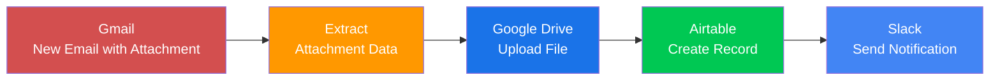

# 🚀 Gmail → Google Drive → Airtable → Slack Automation  
**Save email attachments to cloud, log metadata, and notify your team — automatically.**

**TL;DR:** When a new Gmail message with an attachment arrives, this automation saves the file to Google Drive, logs details in Airtable, and posts a Slack message with a link.  
**Estimated time to build**: **35–45 minutes** (beginner-friendly).

---

## ✅ Prerequisites (Before You Start)

Make sure you have:

| Service | What You Need |
|--------|----------------|
| **n8n** | v1.40+ (cloud or self-hosted). [Sign up free](https://n8n.io) or run via Docker. |
| **Gmail** | A Google account with access to inbox. Enable 2FA for security. |
| **Google Drive** | Folder named `/n8n/Email Attachments` (or use root). |
| **Airtable** | Free account + new base with table `Email Attachments` (see fields below). |
| **Slack** | Workspace with a bot token for `#automation-logs` (or your channel). |

### Airtable Table Setup
Create a new base with these **fields**:

| Field Name | Type |
|-----------|------|
| Subject | Single line text |
| From | Email |
| Received At | Date |
| Attachment Name | Single line text |
| Drive Link | URL |
| Message ID | Single line text (mark as **unique**) |

> 🔐 **Credentials to prepare**:
> - `gmail-account-{{YOUR_NAME}}` (OAuth)
> - `gdrive-account-{{YOUR_NAME}}` (OAuth)
> - `airtable-api-{{YOUR_NAME}}` (API key)
> - `slack-bot-{{YOUR_NAME}}` (Bot token)

---

## 🧩 Architecture Diagram

### Mermaid Flowchart (Copy-Pasteable)



### 🔍 Diagram Explanation

1. **Gmail**: Listens for new emails with attachments.
2. **Extract Data**: Pulls out file and sender info.
3. **Google Drive**: Saves the file securely.
4. **Airtable**: Logs metadata (who, when, what).
5. **Slack**: Sends a clickable notification.

### 🖼️ Image Prompt for AI (DALL·E / Stable Diffusion)

> "Flat design architecture diagram: five rectangular nodes in a horizontal flow. Gmail (red), Extract (orange), Drive (blue), Airtable (green), Slack (dark blue). Arrows connect them left to right. Use modern icons: envelope, gear, cloud, spreadsheet, speech bubble. Clean sans-serif font. White background."

---

## 🛠️ Step-by-Step Guide (With Visual Mockups)

---

### Step 1: Add Gmail Trigger

- Click **+** → Search `Gmail` → Select **Gmail: Trigger**
- Set:
  - **Trigger**: `New Email`
  - **Search Query**: `has:attachment is:unread`
  - **Polling Interval**: `5 minutes`
- Click **Connect Account** → Log in to Google → Allow access.

📸 **Mockup**: `01_gmail_trigger.png`  
**ALT text**: n8n editor with Gmail Trigger node selected. Inspector shows "New Email", search query "has:attachment is:unread", and connected Gmail account.  
**Image prompt**: "n8n UI, left panel with Gmail node, main canvas, node inspector open showing Trigger=New Email, Search Query=has:attachment is:unread, Polling=5 min, credentials dropdown filled"  
> 💡 **Your real screenshot should show**: Green checkmark on credentials and correct search query.

---

### Step 2: Extract Attachment (Function Node)

- Add **Function Item** node.
- Name: `Extract Attachment Data`
- Paste code:

```js
// Get first attachment and email metadata
const msg = $input.all()[0].json;
const attachment = msg.attachments?.[0];

if (!attachment) {
  return [{ json: { error: "No attachment" } }];
}

return [
  {
    json: {
      fileName: attachment.fileName,
      fileContent: attachment.content,
      messageSubject: msg.subject,
      messageFrom: msg.from,
      messageId: msg.messageId,
    },
  },
];
```

📸 `02_function_extract.png`  
**ALT text**: Function node editor with JavaScript code extracting fileName, fileContent, subject, and from.  
**Image prompt**: "n8n UI, Function node open, code editor showing JavaScript to extract attachment and email fields, input data panel visible on right"  
> 💡 **Your real screenshot should show**: Code pasted and node connected to Gmail.

---

### Step 3: Upload to Google Drive

- Add **Google Drive: Upload File**
- Set:
  - **File Content**: `{{$node["Extract Attachment Data"].json["fileContent"]}}`
  - **File Name**: `{{$node["Extract Attachment Data"].json["fileName"]}}`
- **Credentials**: Connect Google Drive (OAuth, scope: `https://www.googleapis.com/auth/drive`)
  - Save as: `gdrive-account-{{YOUR_NAME}}`

📸 `03_drive_upload.png`  
**ALT text**: Google Drive Upload node with File Name and File Content fields mapped using expressions.  
**Image prompt**: "n8n UI, Google Drive Upload node open, inspector showing File Content and File Name mapped via expressions, credentials selected, operation=Upload File"  
> 💡 **Your real screenshot should show**: Mapped expressions and valid credentials.

---

### Step 4: Save to Airtable

- Add **Airtable: Create Record**
- Set:
  - **Base ID**: `appgA5rRUBbKpQXzW` (replace with yours)
  - **Table**: `Email Attachments`
- Map fields using expressions:

| Airtable Field | Value |
|----------------|-------|
| Subject | `{{$node["Extract Attachment Data"].json["messageSubject"]}}` |
| From | `{{$node["Extract Attachment Data"].json["messageFrom"]}}` |
| Received At | `{{$now}}` |
| Attachment Name | `{{$node["Extract Attachment Data"].json["fileName"]}}` |
| Drive Link | `{{$node["Google Drive Upload"].json["webViewLink"]}}` |
| Message ID | `{{$node["Extract Attachment Data"].json["messageId"]}}` |

📸 `04_airtable_create.png`  
**ALT text**: Airtable node with all six fields mapped using dynamic expressions from previous nodes.  
**Image prompt**: "n8n UI, Airtable Create Record node open, field mappings shown with expressions, Base ID and Table selected, credentials dropdown active"  
> 💡 **Your real screenshot should show**: All fields correctly mapped.

---

### Step 5: Notify Slack

- Add **Slack: Send Message**
- Set:
  - **Channel**: `#automation-logs`
  - **Text**:
    ```
    📎 *New Attachment Saved* 
    File: *{{$node["Extract Attachment Data"].json["fileName"]}}*
    From: {{$node["Extract Attachment Data"].json["messageFrom"]}}
    🔗 <{{$node["Google Drive Upload"].json["webViewLink"]}}|Open in Drive>
    ```
- **Credentials**: Add Slack bot token with scopes: `chat:write`, `files:write`

📸 `05_slack_notify.png`  
**ALT text**: Slack Send Message node with formatted text including dynamic file name and Drive link.  
**Image prompt**: "n8n UI, Slack Send Message node open, message text with bold formatting and Drive link using expression, channel set to #automation-logs"  
> 💡 **Your real screenshot should show**: Message text with working expressions.

---

### Step 6: Connect All Nodes

Drag connections in the editor:

```
Gmail Trigger → Extract Attachment Data → Google Drive Upload → Airtable → Slack
```

✅ All nodes should be green when saved.

📸 `06_workflow_connected.png`  
**ALT text**: Full workflow canvas with five nodes connected in sequence.  
**Image prompt**: "n8n UI, full workflow view: five nodes in a straight line from left to right, Gmail to Slack, all connected with green lines, top toolbar visible"  
> 💡 **Your real screenshot should show**: A clean, linear flow with no errors.

---

## 📥 Full Workflow JSON (Import Ready)

```json
{
  "nodes": [
    {
      "parameters": {
        "event": "newEmail",
        "search": "has:attachment is:unread",
        "onlyUnread": true,
        "pollTimes": {
          "item": [
            {
              "mode": "everyX",
              "amount": 5,
              "unit": "minutes"
            }
          ]
        }
      },
      "name": "Gmail Trigger",
      "type": "n8n-nodes-base.gmailTrigger",
      "position": [250, 300],
      "credentials": {
        "gmailOAuth2": "gmail-account-{{YOUR_NAME}}"
      }
    },
    {
      "parameters": {
        "functionCode": "const msg = $input.all()[0].json; const attachment = msg.attachments?.[0]; if (!attachment) return [{ json: { error: 'No attachment' } }]; return [{ json: { fileName: attachment.fileName, fileContent: attachment.content, messageSubject: msg.subject, messageFrom: msg.from, messageId: msg.messageId } }];"
      },
      "name": "Extract Attachment Data",
      "type": "n8n-nodes-base.functionItem",
      "position": [450, 300]
    },
    {
      "parameters": {
        "resource": "file",
        "operation": "upload",
        "fileContent": "={{$node[\"Extract Attachment Data\"].json[\"fileContent\"]}}",
        "fileName": "={{$node[\"Extract Attachment Data\"].json[\"fileName\"]}}",
        "options": {}
      },
      "name": "Google Drive Upload",
      "type": "n8n-nodes-base.googleDrive",
      "position": [650, 300],
      "credentials": {
        "googleApi": "gdrive-account-{{YOUR_NAME}}"
      }
    },
    {
      "parameters": {
        "operation": "create",
        "resource": "record",
        "baseId": "appgA5rRUBbKpQXzW",
        "table": "tblXXXXXXXXXXXXXX",
        "fields": {
          "values": {
            "fldSubject": "={{$node[\"Extract Attachment Data\"].json[\"messageSubject\"]}}",
            "fldFrom": "={{$node[\"Extract Attachment Data\"].json[\"messageFrom\"]}}",
            "fldReceivedAt": "={{$now}}",
            "fldAttachmentName": "={{$node[\"Extract Attachment Data\"].json[\"fileName\"]}}",
            "fldDriveLink": "={{$node[\"Google Drive Upload\"].json[\"webViewLink\"]}}",
            "fldMessageId": "={{$node[\"Extract Attachment Data\"].json[\"messageId\"]}}"
          }
        }
      },
      "name": "Airtable Create Record",
      "type": "n8n-nodes-base.airtable",
      "position": [850, 300],
      "credentials": {
        "airtableApi": "airtable-api-{{YOUR_NAME}}"
      }
    },
    {
      "parameters": {
        "resource": "message",
        "operation": "send",
        "channel": "#automation-logs",
        "text": "={{\"\\\\n📎 *New Attachment Saved* \\\\nFile: *\" + $node[\"Extract Attachment Data\"].json[\"fileName\"] + \"*\\\\nFrom: \" + $node[\"Extract Attachment Data\"].json[\"messageFrom\"] + \"\\\\n🔗 <\" + $node[\"Google Drive Upload\"].json[\"webViewLink\"] + \"|Open in Drive>\"}}"
      },
      "name": "Slack Send Message",
      "type": "n8n-nodes-base.slack",
      "position": [1050, 300],
      "credentials": {
        "slackApi": "slack-bot-{{YOUR_NAME}}"
      }
    }
  ],
  "connections": {
    "Gmail Trigger": {
      "main": [
        [
          {
            "node": "Extract Attachment Data",
            "type": "main",
            "index": 0
          }
        ]
      ]
    },
    "Extract Attachment Data": {
      "main": [
        [
          {
            "node": "Google Drive Upload",
            "type": "main",
            "index": 0
          }
        ]
      ]
    },
    "Google Drive Upload": {
      "main": [
        [
          {
            "node": "Airtable Create Record",
            "type": "main",
            "index": 0
          }
        ]
      ]
    },
    "Airtable Create Record": {
      "main": [
        [
          {
            "node": "Slack Send Message",
            "type": "main",
            "index": 0
          }
        ]
      ]
    }
  },
  "active": false,
  "settings": {},
  "tags": []
}
```

> 📥 **Import Instructions**:
> 1. In n8n, go to **Workflows** → **Import from file**.
> 2. Paste this JSON.
> 3. Replace `{{YOUR_NAME}}` and placeholder IDs.

---

## 🧪 Testing: What to Expect

### Test Case: Send Email with PDF

1. Send email to yourself:  
   - Subject: `Test Report.pdf`  
   - Attachment: `test.pdf` (small file)
2. Wait up to 5 minutes (polling interval).
3. Check:
   - ✅ File in Google Drive
   - ✅ Record in Airtable
   - ✅ Message in Slack

### Success Log (n8n Execution View)

| Node | Status | Output Preview |
|------|--------|----------------|
| Gmail Trigger | ✅ | `{ subject: "Test Report.pdf", attachments: [...] }` |
| Google Drive | ✅ | `{ webViewLink: "https://..." }` |
| Airtable | ✅ | `Record created: ID recABC123` |
| Slack | ✅ | `Message sent to #automation-logs` |

---

## ❓ Troubleshooting & FAQ

| Problem | Quick Fix |
|--------|----------|
| No trigger after 5 min | Mark email as **unread** and ensure it has an attachment. |
| Drive upload fails | File too large? n8n supports < 5MB. Try smaller file. |
| Airtable: "Invalid field" | Use **field IDs** (enable in Airtable API settings). |
| Slack: "Channel not found" | Use channel **ID** (e.g., `C012AB3CD`), not name. |
| Expression error | Wrap in `{{}}`, use `?.` for optional fields. |
| Self-hosted not triggering | Run `ngrok http 5678` and set `WEBHOOK_URL`. |

---

## 🔒 Security & Deployment

- **Never store secrets in JSON** — use n8n’s **Credentials Store**.
- **Encrypt data** with `N8N_ENCRYPTION_KEY` environment variable.
- **Run behind Nginx/Caddy** with HTTPS.
- **Use ngrok** for local testing: `ngrok http 5678`
- **Enable auth** for n8n dashboard:
  ```env
  N8N_BASIC_AUTH_USER=admin
  N8N_BASIC_AUTH_PASSWORD=securepassword123
  ```

---

## 🌟 Best Practices & Next Steps

| Action | Why |
|------|-----|
| ✅ Use **Catch Error** node | Get notified of failures |
| ✅ Add **Set** nodes for debugging | Log intermediate values |
| ✅ Version control workflow | Save JSON in Git |
| ✅ Monitor with **Sentry** | Catch runtime issues |
| ✅ Schedule backups | Export workflows weekly |
| ✅ Add webhooks later | Replace polling with instant triggers |

---

## ✅ Final 7-Step Checklist

1. [ ] ✅ Connect **Gmail** and **Google Drive** OAuth accounts.
2. [ ] ✅ Create **Airtable base** with correct field names.
3. [ ] ✅ Generate **Slack bot token** and invite bot to channel.
4. [ ] ✅ Import **workflow JSON** and replace placeholders.
5. [ ] ✅ Send a **test email** with attachment.
6. [ ] ✅ Verify **file in Drive**, **record in Airtable**, **message in Slack**.
7. [ ] ✅ Mark workflow as **Active** and celebrate! 🎉

---

